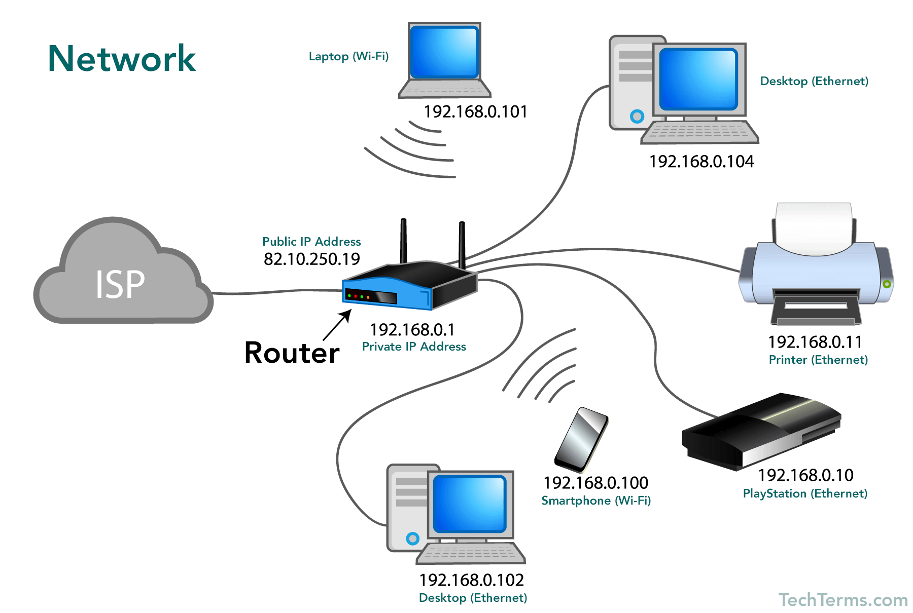
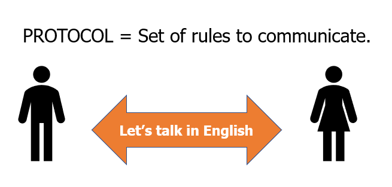
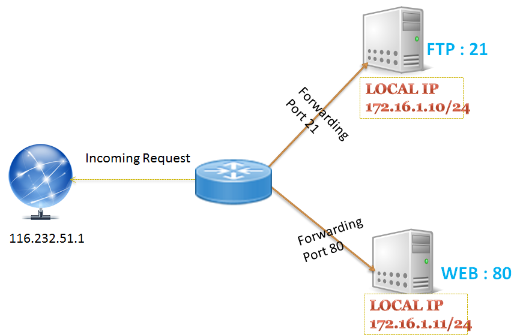
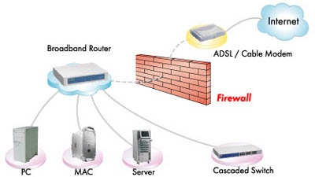
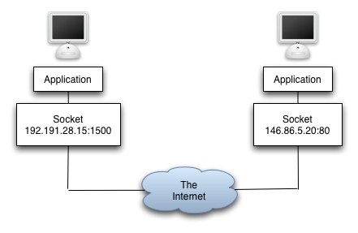
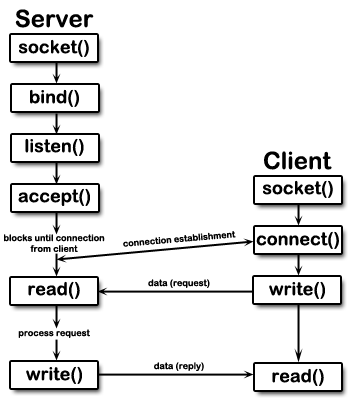
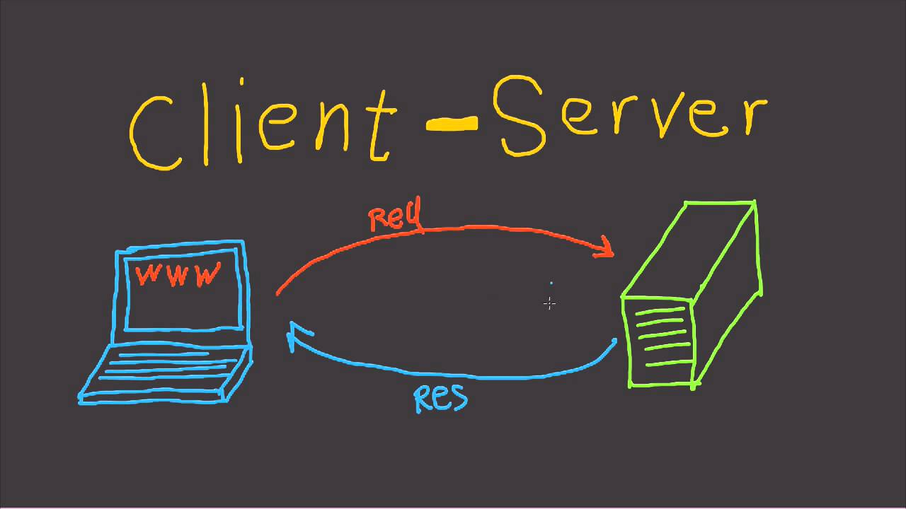

# Chat Application
- ## Socket Programming
    Socket programming is a way of connecting two nodes on a network to communicate with each other. One socket (node) listens on a particular port at an IP, while another socket reaches out to the other to form a connection. The server forms the listener socket while the client reaches out to the server. Socket programs are used to communicate between various processes usually running on the same or different systems. It is mostly used to create a client-server environment.

    

- ## Background
    So before getting started let's try to understand some basic keywords that we are going to talk about.
    - ### Network
        The network is an advanced broadcast communications arrangement for sharing assets between nodes, which are computing devices that use a common telecommunications technology.

        
    - ### Protocol
        In telecommunication, a communication protocol is a system of rules that allow two or more entities of a communications system to transmit information via any kind of variation of a physical quantity.

        
    - ### IP address
        An Internet Protocol address is a numerical label assigned to each device connected to a computer network that uses the Internet Protocol for communication. An IP address serves two main functions: host or network interface identification and location addressing.

        1. Static means the IP address never changes as long as you stay with the same provider or same server. 
        2. Dynamic means the IP address can change from time-to-time.
        3. Public means the IP address can be visited from any computer in the world.
        4. Private means the IP address can only be used by those on the same network.
    - ### Port
        In computer networking, a port is a communication endpoint. At the software level, within an operating system, a port is a logical construct that identifies a specific process or a type of network service.

        

        Port forwarding or port mapping is an application of network address translation that redirects a communication request from one address and port number combination to another while the packets are traversing a network gateway, such as a router or firewall.

    - ### Firewall

        A Firewall is a network security system that monitors and controls incoming and outgoing network traffic based on predetermined security rules. A firewall typically establishes a barrier between a trusted internal network and untrusted external network, such as the Internet.

        
        
    - ### Socket
        A network socket is an internal endpoint for sending or receiving data within a node on a computer network. Concretely, it is a representation of this endpoint in networking software, such as an entry in a table, and is a form of system resource.

        

    - ### Types of Internet Sockets
        * Stream Sockets (SOCK_STREAM)
            1.  Connection oriented
            2.    Rely on TCP to provide reliable two-way       connected communication
        *   Datagram Sockets (SOCK_DGRAM)
            1.  Rely on UDP
            2.  Connection is unreliable

- ## Server - Client Architecture

    

    - ### Server Side Programming
        A server is a type of computer or device on a network that manages network resources. Servers are often dedicated, meaning that they perform no other tasks besides their server tasks. On multiprocessing operating systems, however, a single computer can execute several programs at once.

        * Socket Creation 
        * bind() what port am I on?
        * listen() - Call me please!
        * accept() - Thank you for calling !
        * send() and recv() - Let's talk!

    - ### Client Side programming
        A client is a piece of computer hardware or software that accesses a service made available by a server. The server is often on another computer system, in which case the client accesses the service by way of a network.

        * Socket Creation
        * connect() - Hello!
        * send() and recv() - Let's talk!

    

- ## How does a web work?

    

